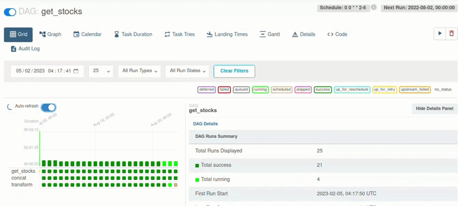
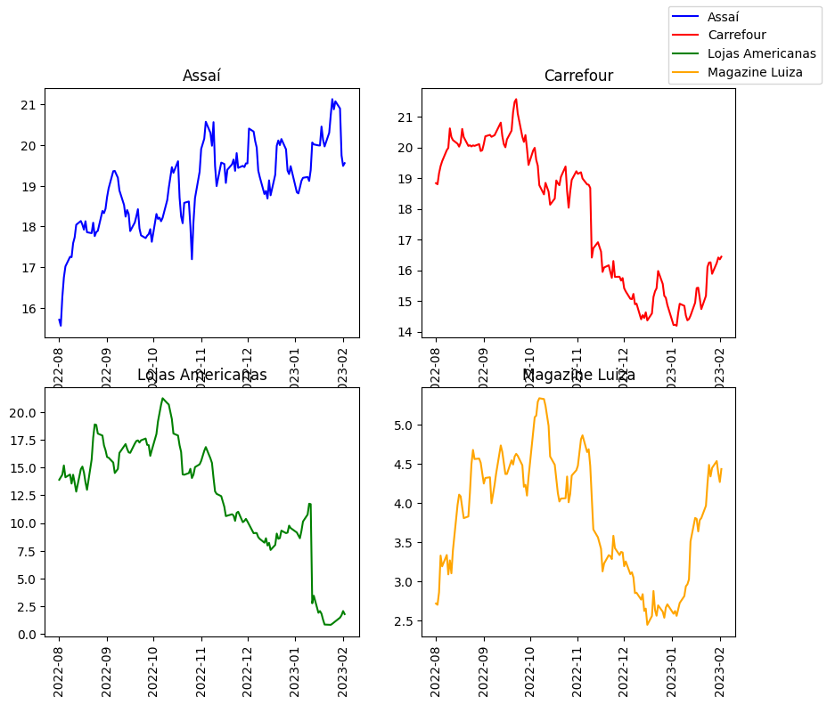
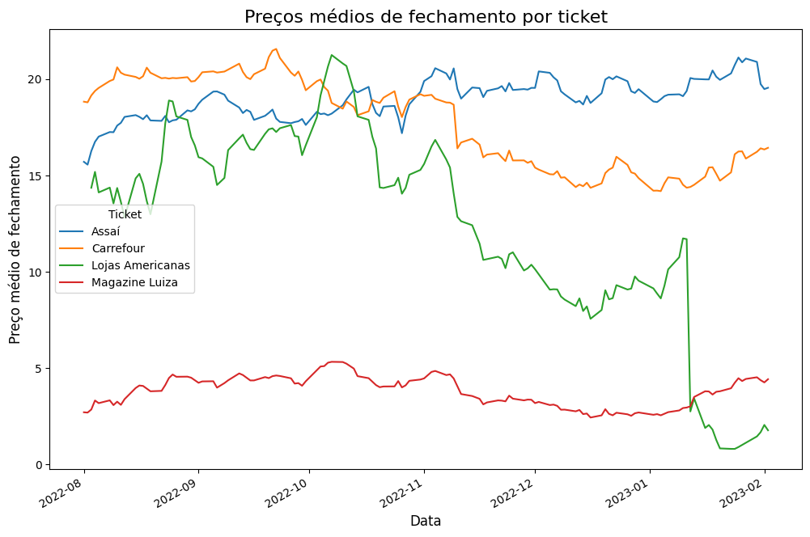

# Apache Airflow: extração de dados da API do Yfinance  

[](https://badge.fury.io/py/apache-airflow)
[](https://github.com/apache/airflow/actions)
[](http://www.apache.org/licenses/LICENSE-2.0.txt)
[](https://pypi.org/project/apache-airflow/)

Este projeto é uma implementação de fluxo de trabalho de análise de dados financeiros utilizando a plataforma Apache Airflow e a API Yfinance. A API Yfinance fornece informações financeiras em tempo real e históricas para uma ampla gama de ativos, incluindo ações, fundos imobiliários e criptomoedas.

Neste projeto específico, utilizamos a API Yfinance para baixar dados financeiros dos quatro maiores varejistas do Brasil, listados abaixo:

    
| Empresa      | Ticket         |
| ------------ | -------------- |
| Carrefour    | CRFB3.SA       |
| Assaí        | ASAI3.SA       |
| Lojas Americanas    | AMER3.SA       |
| Magazine Luiza        | MGLU3.SA       |

Com o objetivo de realizar análises financeiras sobre essas empresas e, assim, ajudar investidores a tomar decisões informadas de investimento.

As operações DAG incluídas neste projeto baixam dados financeiros dessas empresas, realizam análises e armazenam os resultados em um banco de dados relacional. As informações dos ativos que desejam ser analisados, incluindo símbolo de ativo, período de tempo e frequência de atualização, podem ser configuradas nas variáveis de ambiente no arquivo config.py.

Este projeto é uma ferramenta valiosa para investidores interessados em obter insights financeiros sobre as maiores empresas de varejo do Brasil, especialmente sobre a Lojas Americanas.

Este projeto é uma implementação de fluxo de trabalho de análise de dados financeiros utilizando a plataforma Apache Airflow e a API Yahoo Finance.

## Índice

- [Instalação](#instalação)
- [Uso](#uso)
- [Contribuição](#contribuição)
- [Licença](#licença)
- [Links](#links)


## Instalação

Iniciamos configurando o ambiente, instalando o Airflow e executando-o pela primeira vez. Recebemos avisos relacionados ao banco de dados SQLite e ao executor Sequential. Em seguida, conhecemos a biblioteca YFinance e criamos um DAG para extrair dados sobre ações das bolsas de valores.

```bash
pip install yfinance
```

```bash
pip install apache-airflow==1.10.12 \
 --constraint "https://raw.githubusercontent.com/apache/airflow/constraints-1.10.12/constraints-3.7.txt"
```

Configuramos um executor Local, instalamos o Postgres, criamos um banco de dados e um novo usuário para conectá-lo ao Airflow. Utilizamos o Celery, incluindo sua fila de tarefas e workers, e instalamos o Redis como mediador. Configuramos o Celery juntamente com um worker para executar as tarefas do nosso DAG.


```bash
sudo apt install postgresql postgresql-contrib
```

O parâmetro "worker_concurrency", que define a quantidade de tarefas simultâneas que um worker pode executar, foi definido, e criamos um novo DAG para extrair dados sobre OS Tickets selecionados.

## Uso

Este projeto inclui operações DAG que baixam dados financeiros de ativos específicos da API Yfinance, realizam análises e armazenam os resultados em um banco de dados relacional.

Você pode configurar as informações dos ativos que deseja analisar, incluindo símbolo de ativo, período de tempo e frequência de atualização, nas variáveis de ambiente no arquivo config.py.



## Analise dos Dados obtidos 



Recentemente, foi observado que as ações da Lojas Americanas sofreram uma queda histórica de 77,33%, a maior desde 1994, após terem entrado em leilão no Ibovespa. Os papéis da empresa foram cotados a R$ 2,44, com um tombo de 79,67%, e oscilaram entre R$ 2,40 a R$ 2,95 durante o dia.

Por outro lado, as outras três empresas analisadas (Carrefour, Assaí e Magazine Luiza) permaneceram estáveis em comparação às Lojas Americanas. Isso pode ser observado no gráfico fornecido.

No geral, o uso da API Yfinance e da plataforma Apache Airflow demonstrou ser uma solução eficaz para coletar, analisar e armazenar dados financeiros de várias empresas de maneira automatizada e escalável. Essa abordagem pode ser aplicada a outras empresas e setores, fornecendo insights valiosos para investidores e tomadores de decisão.




## Contribuição

Este projeto é aberto a contribuições. Se você deseja melhorar ou adicionar recursos, sinta-se à vontade para criar uma solicitação pull ou entrar em contato.

## Licença

Este projeto está disponível sob a [licença](https://www.apache.org/licenses/LICENSE-2.0)

## Links

- [Documentation Apache Airflow](https://airflow.apache.org/docs/stable/)
- [Documentation API Yahoo Finance](https://python-yahoofinance.readthedocs.io/en/latest/)
